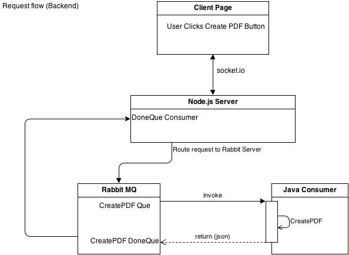

What is this
--------------------

This project was for TA's and professors. What it does is allows the professor to make questions for a test/exam. We take care of creating a pdf of all the tests while randomizing the order and answer order for every test. Once the test is administered, the files are uploaded. Where we score and provide analysis on the results. This can be agregated across professors, questions, and students. 

Server Architecture
--------------------

The above image shows how the requests moves from the client page button, to the node server, to a rabbitMQ instance que, to a java consumer which does the work creating the pdf. It then returns to the rabbitMQ que with a response, which nodejs is consuming from. Finally a message is sent to the client page using socket.io

This version is a bit messy despite removing the DB and a redis instance that must exist. This repo is only of the java instance which consumes from the rabbitMQ server. It is modularized so that i can spin up multiple java consumers to handle dynamic loads. For example I could set it up to have a minimum of 10 java consumers. If the rabbitMQ server starts to have a backlog of requests, more java consumers can be created to speed up the responses. 